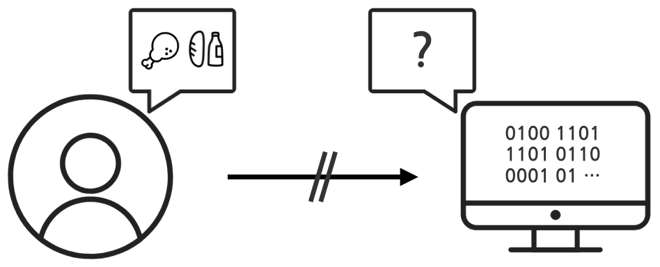
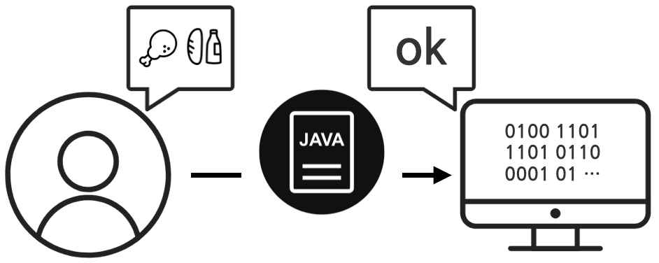
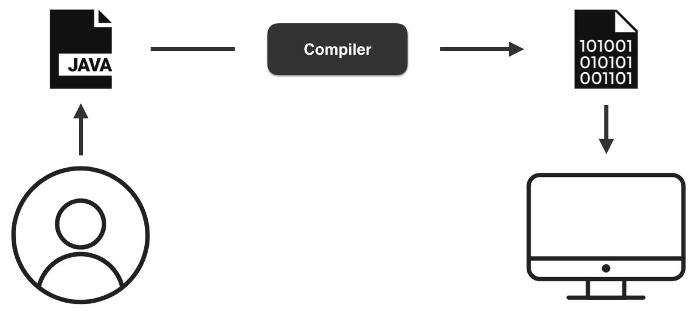
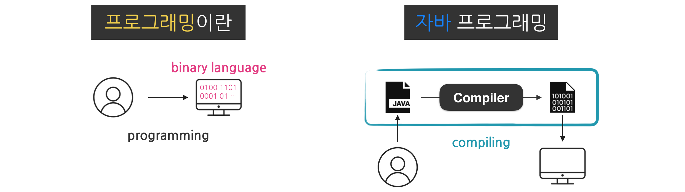

# 자바 프로그래밍이란?

> 인프런 홍팍 그림으로 배우는 자바 입문

## 프로그래밍

------

#### 무엇?

프로그래밍이란, 컴퓨터에게 일을 시키는 것이다.


#### 필요성?

컴퓨터는 빠르고, 24시간 일을 할 수 있다. 이와 반면 사람은 상대적으로 느리고, 또 반복적인 일을 싫어한다. 벌써 느낌이 온다. 놀면서 돈과 시간을 벌 수 있는 이 시대의 마법. 프로그래밍을 배워보자.


#### 어떻게 일을 시키지?

컴퓨터한테 “맛집을 찾아줘”라고 하면 컴퓨터는 이를 이해하지 못한다. 사람과 컴퓨터는 사용하는 언어가 다르기 때문이다. 컴퓨터는 0과 1만으로 이루어진 언어를 사용한다. 이를 바이너리(binary) 언어라 한다.


## 자바 프로그래밍

------

#### 역할

자바는 이러한 문제를 해결하는 도구이다. 자바는 사람의 명령을 컴퓨터의 언어로 바꿔준다. 이렇게 자바 언어로 컴퓨터에게 일을 시키는 것. 이를 자바 프로그래밍이라 한다.


#### 과정

개발자는 컴퓨터에게 시킬 일들을 자바 언어로 작성한다. 이렇게 작성된 코드를 소스코드라 한다. 소스코드는 컴파일러(compiler)라는 번역기를 통해 기계어로 바뀐다. 비로소 컴퓨터는 기계어를 수행하게 된다. 특별히 자바 코드가 기계어로 번역되는 과정. 이를 컴파일링(compiling) 이라 한다.


## 요약

------



- 프로그래밍이란, 컴퓨터에게 일을 시키는 것이다.
- 바이너리 언어란, 0과 1만으로 이루어진 컴퓨터 언어이다.
- 자바를 통해 프로그래밍이 가능하다.
- 컴파일링이란, 소스코드가 기계어로 번역되는 것이다.


## 문법

#### 출력하기

이러한 문자열의 출력은 `println()` 메소드를 사용한다. 해당 메소드 소괄호 사이에, 출력할 문자열을 넣는다.

```java
System.out.println("출력할 문자열을 적어주세요!");
```

```java
public class Hello {
  public static void main(String[] args) {
    System.out.println("Hello World!");
  }
}
```


### 주석

```java
// 한 줄 주석: 글자 앞쪽에 슬래시를 두 번 씁니다.
/* 블럭 주석(여러 줄 주석):
   글자 앞뒤를
   슬래시와 별표시로
   감쌉니다. */
```


### 클래스

자바 프로그램의 최소 단위. 자바 프로그램은 적어도 하나의 클래스를 가지며, 그 구조는 아래와 같다.

```java
public class CLASSNAME {
    /* 클래스 내부 내용 생략..*/
}
```


### 메인 메소드

프로그램 실행의 시작점

#### 구조

메인 메소드는 클래스 내부에 위치하며, 아래와 같은 구조를 갖는다.

```java
// Pizza 클래스 - 프로그램의 최소 단위
public class Pizza {
  // 메인 메소드 - 프로그램 실행의 시작점
  public static void main(String[] args) {
    // 실행될 코드들..
  }
}
```

