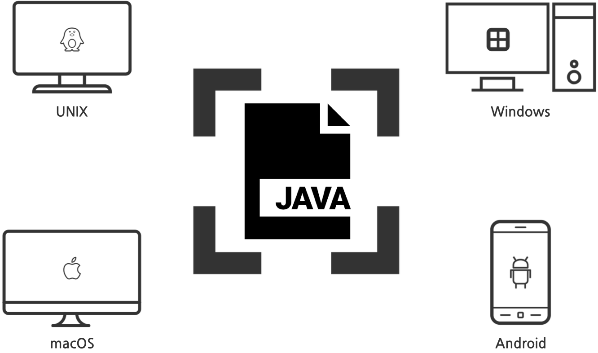

# 자바 프로그래밍이란?

> 인프런 홍팍 그림으로 배우는 자바 입문

## 프로그래밍

------

#### 무엇?

프로그래밍이란, 컴퓨터에게 일을 시키는 것이다.


#### 필요성?

컴퓨터는 빠르고, 24시간 일을 할 수 있다. 이와 반면 사람은 상대적으로 느리고, 또 반복적인 일을 싫어한다. 벌써 느낌이 온다. 놀면서 돈과 시간을 벌 수 있는 이 시대의 마법. 프로그래밍을 배워보자.


#### 어떻게 일을 시키지?

컴퓨터한테 “맛집을 찾아줘”라고 하면 컴퓨터는 이를 이해하지 못한다. 사람과 컴퓨터는 사용하는 언어가 다르기 때문이다. 컴퓨터는 0과 1만으로 이루어진 언어를 사용한다. 이를 바이너리(binary) 언어라 한다.


## 자바 프로그래밍

------

#### 역할

자바는 이러한 문제를 해결하는 도구이다. 자바는 사람의 명령을 컴퓨터의 언어로 바꿔준다. 이렇게 자바 언어로 컴퓨터에게 일을 시키는 것. 이를 자바 프로그래밍이라 한다.


#### 과정

개발자는 컴퓨터에게 시킬 일들을 자바 언어로 작성한다. 이렇게 작성된 코드를 소스코드라 한다. 소스코드는 컴파일러(compiler)라는 번역기를 통해 기계어로 바뀐다. 비로소 컴퓨터는 기계어를 수행하게 된다. 특별히 자바 코드가 기계어로 번역되는 과정. 이를 컴파일링(compiling) 이라 한다.


## 요약

------


- 프로그래밍이란, 컴퓨터에게 일을 시키는 것이다.
- 바이너리 언어란, 0과 1만으로 이루어진 컴퓨터 언어이다.
- 자바를 통해 프로그래밍이 가능하다.
- 컴파일링이란, 소스코드가 기계어로 번역되는 것이다.


## 자바의 특징과 객체지향

프로그래밍 언어 자바. 이는 어떤 특징이 있을까?

## 프로그래밍 언어, 자바

------

프로그래밍이란, 컴퓨터에게 일을 시키는 것이다. 이를 위한 언어로는 자바, Python, C 등이 있다. 이러한 언어를 프로그래밍 언어라 한다. 프로그래밍 언어로서의 자바! 어떠한 특징이 있을까?


## 많이 쓰이는 언어

------

자바는 전 세계적으로 많이 사용된다. 널리 사용되는 만큼, 많은 일자리 수요가 있다. 특히 국내의 경우, 큰 규모의 프로젝트일수록 자바를 선호한다. 정부 및 대기업의 웹 프로젝트는 대부분 자바로 진행된다.


## 멀티 플랫폼 언어

------

자바는 멀티 플랫폼 언어다. 자바로 작성된 코드는 다양한 운영체제(UNIX, Window, MacOS, Android, etc..)에서 변경없이 동작한다. 이러한 특징을 “이식성이 좋다”고 한다.


## 객체 지향 언어

------

자바는 객체 지향 프로그래밍(Object-Oriented Programming) 언어다. 쉽게 말해, 객체를 조립하여 전체 프로그램을 만드는 언어다. 자전거를 전체 프로그램, 각 부품을 객체라고 생각하면 이해가 쉽다.


현대의 모든 프로그래밍 언어는 객체 지향 패러다임을 따른다. 조립식으로 만들어진 프로그램은 여러 장점이 있기 때문이다. 예를 들어 고장이 난 경우, 해당 부품만 갈아주면 된다. 추가로 특정 기능들을 손쉽게 개선 또는 확장할 수 있다.

## 요약

------


- 프로그래밍 언어는 다양(Java, Python, C, …)하다.
- 자바의 특징은 아래와 같다.
  - 수요 많음
  - 이식성 좋음
  - 객체 지향(조립식 프로그래밍 가능)


## 문법

#### 출력하기

이러한 문자열의 출력은 `println()` 메소드를 사용한다. 해당 메소드 소괄호 사이에, 출력할 문자열을 넣는다.

```java
System.out.println("출력할 문자열을 적어주세요!");
```

```java
public class Hello {
  public static void main(String[] args) {
    System.out.println("Hello World!");
  }
}
```


### 주석

```java
// 한 줄 주석: 글자 앞쪽에 슬래시를 두 번 씁니다.
/* 블럭 주석(여러 줄 주석):
   글자 앞뒤를
   슬래시와 별표시로
   감쌉니다. */
```


### 클래스

자바 프로그램의 최소 단위. 자바 프로그램은 적어도 하나의 클래스를 가지며, 그 구조는 아래와 같다.

```java
public class CLASSNAME {
    /* 클래스 내부 내용 생략..*/
}
```


### 메인 메소드

프로그램 실행의 시작점

#### 구조

메인 메소드는 클래스 내부에 위치하며, 아래와 같은 구조를 갖는다.

```java
// Pizza 클래스 - 프로그램의 최소 단위
public class Pizza {
  // 메인 메소드 - 프로그램 실행의 시작점
  public static void main(String[] args) {
    // 실행될 코드들..
  }
}
```


### 문자열 변수

```java
// 문자열(String)을 위한 변수, food 생성
String food;
// 변수 food에, “치킨”이라는 값을 저장
food = "치킨";
System.out.println(food); // "치킨" 출력
```


### 숫자 변수

```java
// 정수(int)을 위한 변수, midScore 생성
int midScore;
// 변수 midScore, 100이라는 값을 저장
midScore = 100;
System.out.println(midScore); // 100 출력

// 실수(double) 변수 만들기
double weight;
weight = 99.99;
System.out.println(weight);
```


### 논리형 변수(Boolean)

```java
// 논리형 변수 생성
boolean isMale;

// 참/거짓 값 대입
isMale = false;

// 논리형 변수 isMale의 값 출력
System.out.println(isMale);
```


**추가로, 문자열과 변수는 덧셈 연산이 가능하며, 이를 통해 하나의 문자열로 연결할 수 있다**

```java
System.out.println("가격: " + price + "원");
// 가격: 35000원
```


```java
/* 1. 클래스 생성 */
public class Lab02Review {
    /* 2. 메인 메소드 생성 */
    public static void main(Strings[] args) {
        /* 3. 변수 생성 및 초기화(초기값 설정) */
        String name = "홍팍";
        int age = 34;
        double weight = 72.4;
        boolean isMale = true;

        /* 4. 결과 출력 */
        System.out.println("이름: " + name);
        System.out.println("나이: " + age + "세");
        System.out.println("몸무게: " + weight + "kg");
        System.out.println("남성인가요? " + isMale);
    }
}
```


## 변수와 타입, 연산자

```java
int age = 34;
// int -> 타입
```

### 변수

> 변수(variables)란 변하는 수로서, 이름 붙여진 메모리 공간이다. 여기서 메모리(memory)란, 컴퓨터의 핵심 부품으로 기억을 담당한다. 또 다른 핵심 부품으로는 CPU(연산 담당)가 있다.

#### 생성법

변수 생성 형식은 아래와 같다.

```java
TYPE NAME; // 변수의 타입을 적고, 뒤에 이름을 붙임.
```

실제 변수 생성 예

```java
int mathScore = 88;            // 수학 점수를 저장할 공간String bookTitle = "오만과 편견"; // 책 이름을 저장할 공간double weight = 72.4;          // 무게를 저장할 공간boolean finished = true;       // 종료 여부를 저장할 공간
```

### 타입

> 타입(types)이란, 변수의 형태이다. 대표적 타입으로는 int(정수형), double(실수형), String(문자열), boolean(논리형) 등이 있다.

```java
// 정수(딱 떨어지는 수) => 3, -7, 0, 10, ...// 실수(정수 + 소수점 이하) => 3.14, -9.81, 0.0, ...// 문자열(문자의 나열) => "hello", "world", ...// 논리형(참/거짓) => true, false
```

> 타입은 또 크게 두 가지 카테고리로 나뉜다. 이는 기본형과 레퍼런스형이다.
> 해당 개념은 추후 객체지향 파트에서 다시 다루도록 하자.

### 연산자

> 연산자(operators)란, 말 그대로 연산 기호이다. 대표적인 연산자로는 더하기(`+`), 빼기(`-`), 곱하기(`*`), 나누기(`/`), 대입(`=`) 등이 있다.

#### 우선순위

연산자는 우선순위에 따라 실행 순서가 결정된다.

```java
int result = 3 + 8 * (3 - 1); // result => 19
```

### 변수값 복사 & 문자열 연결

변수의 값은 대입연산을 통해 복사될 수 있다.

```java
// 변수 생성 및 값 초기화
double origin = 3.14;// 변수 값 복사
double copy = origin;// 변수 값 출력
System.out.println(copy); // 3.14
```

덧붙여 문자열은 덧셈 연산을 통해 연결될 수 있다.

```java
// 문자열 변수 생성
String a = "AAA";
String b = "bbbb";// 문자열 연결을 통한 새 문자열 생성
String c = a + b;// 새 문자열 c를 출력
System.out.println(c); // AAAbbbb
```

### 문자열과 숫자 연결하기

#### 문자열간 연결하기

```java
System.out.println("Hi, " + " Java!");// => Hi, Java!
```

#### 문자열과 숫자 연결하기

이러한 문자열의 연결은 숫자와도 가능

```java
// 정수(int)와 문자열 연결
int hour = 13;
System.out.println("지금은 " + hour + "시");// => "지금은 13시"
// 실수(double)와 문자열 연결
double weight = 1.45;
System.out.println("무게: " + weight + "kg");
// => "무게: 1.45kg"
```

#### 문자열과 논리값 연결하기

추가로 참/거짓(boolean) 또한 덧셈을 통해 연결.

```java
boolean sleepy = true;
System.out.println("슬슬 졸림? " + sleepy);// => "슬슬 졸림? true"
```

### 입력값 받기

코드 작성 창 아래쪽, 입력 창에 값을 넣으면 된다. 이클립스와 같은 IDE의 경우, “자바 이클립스 args”로 구글링


입력된 값은 변수 args[0]를 통해 사용할 수 있다.

```java
System.out.println(args[0]); // 홍길동
```

입력값이 둘 이상인 경우,


첫 입력값은 args[0], 두번째 입력값은 args[1], … 의 순으로 입력된다.

```java
System.out.println(args[0]); // 이순신System.out.println(args[1]); // 안중근
```

입력값은 공백문자(space, enter, …)로 구분된다.

### 입력값 덧셈

 입력값을 그대로 덧셈한 경우, 문자열이 연결될 뿐이다. 숫자 계산은 되지 않는다.

```java
// "123" + "3.14" => "1233.14"
System.out.println(args[0] + args[1]);
```

숫자 계산을 하려면, 입력값을 숫자로 변경해야 합니다.

```java
// 문자열을 정수(int)로 변환: "123" => 123
int a = Integer.parseInt(args[0]);// 문자열을 실수(double)로 변환: "3.14" => 3.14
double b = Double.parseDouble(args[1]);// 숫자 덧셈 후 출력
System.out.println(a + b); // 126.14
```


## 타입과 형변환

### 나눗셈 연산 주의

int와 int의 연산 결과는 int이다. double과 int의 연산은 double이다. 숫자간 연산은 더 큰 타입을 따른다.

```java
double a = 5.0 / 2.0; // 2.5
int b = 4 / 2;        // 2
int c = 5 / 2;        // 2.5 (X) => 2 (O)
```

### 타입 불일치 주의

변수에 값 대입 시, 그 값이 변수의 타입과 일치해야 한다.

```java
// 타입 불일치 에러
int score = "100";
// 해결 방법
int score = 100;      // int로 일치
String score = "100"; // String으로 일치
int score = Integer.parseInt("100"); // "100" => 100
```

### 타입 변환 주의

타입 불일치의 문제는 타입 변환을 통해 해결가능하다. 타입변환은 자동 변환과 직접 변환이 있다.

#### 자동 변환

int는 double로 대입될 수 있다. 2를 2.0으로 보아도 무방하다. 이러한 자동 변환은 더 큰 타입으로 대입 시 발생한다. (byte(1) < short(2) < int(4) < long(8))

```java
// 자동 변환 (더 큰 타입으로 대입될 때)
double p = 2;  // 2 => 2.0
int n = 5 / 2; // 2
double q = n;  // 2 => 2.0
```

#### 직접 변환

거꾸로 double은 int로 대입될 수 없다. 10.4를 10이라고 볼 수 없기때문. 강제로 소수점을 버리고 정수로 만들 순 있다. 이러한 문법을 타입 캐스팅(casting)이라 한다.

```java
// 에러 발생
int r = 10.4; // ERROR
// 실수를 정수로 강제 캐스팅
int r = (int) 10.4; // 10.4 => 10
```

### printf() - 정수값 출력

#### println() 메소드

우리는 앞서 println()을 통해 문자열 출력을 배웠다.

```java
// 변수 생성int age = 34;// A - 결과 출력
System.out.println("홍팍이의 나이는 " + age + "세입니다.");
```

#### printf() 메소드

```java
// B - 결과 출력
System.out.printf("홍팍이의 나이는 %d세입니다.", age);
```

> printf() 메소드는, 출력을 위한 문자열에 값을 삽입시켜 출력한다. 위 코드의 경우, 변수 age의 값이 `%d`의 위치로 삽입되어 출력된다. 여기서 `%d는 정수 타입으로 삽입`하라는 뜻이다.

#### 두 변수 값 삽입 후 출력

두 개 이상의 변수를 삽입하는 것 또한 가능하다. 아래 코드는 정수형 변수 month와 day는, 문자열 속 `%d`에 차례로 삽입돼 출력된다.

```java
// 변수 생성
int month = 10;
int day = 4;// 결과 출력 => "제 생일은 10월 4일입니다."
System.out.printf("제 생일은 %d월 %d일입니다.", month, day);
```

#### 실수 값 삽입-`%f`를 사용

```java
// 변수 생성
double pi = 3.14;// 결과 출력 => "파이의 값은 3.140000 입니다."
System.out.printf("파이의 값은 %f 입니다.", pi);
```

#### 문자열 삽입

printf() 메소드로 문자열 또한 삽입 가능, 이경우 `%s `사용합니다.

```java
// 변수 생성
String name = "홍팍";
String hobby = "산책하기";// 결과 출력 => "이름: 홍팍 취미: 산책하기"
System.out.printf("이름: %s ", name);
System.out.printf("취미: %s", hobby);
```

#### 줄 내림

추가로 줄 내림. 엔터 효과가 필요할 땐, `\n`을 추가한다.

```java
System.out.printf("이름: %s\n", name);
System.out.printf("취미: %s", hobby);
```

#### 소수점 이하 자릿 수 설정

덧붙여 실수값 출력 시, 소수점 이하 자리수를 제한할 수 있다.

```java
// 소수점 이하 2자리까지 출력 => 3.14
double pi = 3.14159265;
System.out.printf("%.2f\n", pi);
// 소수점 이하 5자리까지 출력 => 3.14159
double pi = 3.14159265;
System.out.printf("%.5f\n", pi);
```

### printf() - 캐스팅, 실수를 정수로

#### printf() 기본 출력 형식

printf() 메소드의 출력형식을 정리하면 아래와 같다.

- `%d` - 정수(int)
- `%f` - 실수(double)
- `%s` - 문자열(String)

#### 출력 형식이 다른 경우

삽입하려는 값과 출력 형식의 타입이 불일치하는 경우, 에러가 발생한다.

```java
// 변수 생성
double pi = 3.14;// ERROR: pi의 값은 실수인 3.14, 그런데 정수 형식 %d로 출력하려 함!
System.out.printf("%d", pi);
```

#### 해결 법

삽입 값과 출력 형식을 같게 맞추면 된다.

```java
// A - 출력 형식을 변경!
System.out.printf("%f", pi);
// B - 변수 값을 강제변환(캐스팅),
System.out.printf("%d", (int) pi);
// = System.out.printf("%d", (int) 3.14);
// = System.out.printf("%d", 3);
```

#### 캐스팅, 실수를 정수로 강제 변환

캐스팅이란, 타입을 강제 변환하는 문법이다. 실수는 정수로 캐스팅 가능하다.

```java
// 실수 10.4를 정수(int)로 캐스팅, 소수점 이하 값이 버려짐.
int a = (int) 10.4; // a = 10;
```


#### Math 클래스

Math 클래스는 수학에서 사용되는 변수 및 함수들을 제공합니다. 아래는 그 활용 예이다.

```java
// 원주율 - Math.PI
double pi = Math.PI; // 3.14159265..
// 절대값 - Math.abs();
double x = Math.abs(-9.81); // 9.81
// 반올림 - Math.round();
long n = Math.round(10.6); // 11
```


#### 원의 넓이

```java
public class CircleAreaCalculator {
    public static void main(String[] args) {
        /* 1. 입력값 받기 */
        int r = Integer.parseInt(args[0]); // "4" => 4
        
        /* 2. 원의 넓이(S = pi * r ^ 2) 계산 */
        double s = Math.PI * r * r;
        
        /* 3. 결과 출력 */
        System.out.printf("반지름이 %d인 원의 넓이 => %.3f", r,s);
    }
}
```


## 메소드

일련의 코드를 단순화한 문법. 이를 메소드라 한다. 메소드는 입력에 따른 결과를 반환한다.


### 메소드 호출

만들진 메소드를 사용하는 것. 이를 메소드 호출이라 한다. 아래는 절댓값, 반올림을 반환하는 예이다.


### 메소드 정의

#### 메소드를 사용하기에 앞서

메소드를 사용하려면, 먼저 만들어져 있어야 한다. 다시 말해, 메소드가 정의돼 있어야한다.

#### 메소드 구조

메소드를 만들려면, 그 구성 요소를 알아야 한다. 

메소드는 크게 4가지로 이루어져 있다.

 ① 메소드명(methods name)은 호출 시 사용한다. 

② 입력 변수(parameters)는 입력 값을 저장한다.

③ 반환 값(return value)은 반환될 값이다. 

④ 반환 타입(return type)은 반환 값의 타입이다.


### 메소드 만들기

정수값의 제곱을 반환하는 메소드를 만들어보자.


이를 위해 먼저, ①메소드명을 `square`로 작성한다.

```java
public static ④TYPE square(②PARAMETER) {  
    ...  return ③VALUE;
}
```

다음으로 호출 시, 입력되는 정수 3을 받기 위해 ②파라미터(입력 변수) `int n`을 추가한다.

```java
public static ④TYPE square(int n) {  
    ...  return ③VALUE;
}
```

이제 제곱값을 만들기 위한 일련의 코드를 작성하고, 최종 ③반환 값을 지정한다.

```java
public static ④TYPE square(int n) {  
    int result;
    result = n * n;
    return result;
}
```

마지막 반환 값의 ④타입을 정의한다.

```java
public static int square(int n) {  
    int result;
    result = n * n;
    return result;
}
```

이제 square() 메소드는 아래와 같이 호출 가능한다.

```java
int z = square(4); // 입력: 4 => 반환: 16
System.out.println(z); // 16
```


- 메소드는 일련의 코드를 단순화한다.
- 메소드는 입력에 따른 결과를 반환한다.
- 메소드는 호출부와 정의부로 나뉜다.
- 메소드의 구성 요소는 이름 / 입력 변수 / 반환 값 / 반환 타입이다.


### 단일 파라미터 메소드

> 입력 변수가 하나만 있는 메소드를, 단일 파라미터 메소드라 한다. 여기서 파라미터(parameters)란 입력 변수의 또 다른 표현이다.

```java
# 단일 파라미터 메소드 호출 예
int x = square(4); // 입력값: 4 => 반환값: 16
```

#### 파라미터로의 입력 값 대입

메소드 호출 시 입력한 값은 입력 변수 즉, 파라미터로 대입됩니다.

```java
// 단일 파라미터 메소드 정의 예
public static int square(int n) {  
    int result = n * n; // 변수 생성 및 제곱 값 대입  
    return result; // 값 반환
}
```

### 다중 파라미터 메소드

입력 변수가 2개 이상인 경우, 이를 다중 파라미터 메소드라 한다.

```java
# 다중 파라미터 메소드 호출 예
int a = times(3, 4); // 12
int b = times(5, 6); // 30
```

#### 파라미터로 입력 값 전달

메소드 호출 시 입력한 값은 차례로 파라미터(입력 변수)에 대입됩니다.

```java
// 다중 파라미터 메소드 정의 예
public static int times(int a, int b) {  
    return a * b;
}
```

### 잘못된 파라미터

메소드 호출 시 주의해야할 점이 있다. 이는 입력된 전달과 파라미터(입력 변수)의 타입이 일치해야 한다는 것.

```java
// 메소드 호출 예
int x = foo(0.0); // double을 int로 대입 불가
int y = foo("3"); // String을 int로 대입 불가
// 메소드 정의 예
public static int foo(int n) {  
    return n + n;
}
```

그뿐 아니라, 반환값 또한 항상 신경써야 한다.

```java
// ERROR: 6 => String (X)
String z = foo(3);
```


### 파라미터가 없는 메소드

#### 파라미터가 없는 경우?

메소드의 파라미터는 없을 수도 있다.

```java
// 파라미터가 없는 메소드 호출 예
int a = getTen();
//파라미터가 없는 메소드 정의 예
public static int getTen() {  
    return 10;
}
```

#### Math.random() 메소드

자바에서 제공하는 Math.random() 메소드는 파라미터가 없는 대표적 예. 해당 메소드는 0.0 이상 1.0 미만의 임의 실수를 반환한다.

```java
// 파라미터가 없는 메소드 호출 예
double x = Math.random(); // 0.0 <= x < 1.0
```

#### 1~10 사이의 정수 구하기

아래는 위 메소드를 사용하여, 1부터 10사이의 임의 정수를 구하는 예다.

```java
// 0.0 <= r < 10.0
double r = 10 * Math.random();

// 0, 1, ..., 9 중 하나
int temp = (int) r;

// 1, 2, ..., 10 중 하나
int n = temp + 1;
```

### 리턴값이 없는 메소드

#### void 타입 메소드

메소드에 항상 리턴값이 존재하는 것은 아니다. 반환할 값이 없는 경우, 타입의 자리에 void를 넣어준다.

```java
// 리턴값이 없는 메소드 호출 예
printHello();
// 리턴값이 없는 메소드 정의 예
public static void printHello() {  
    System.out.println("Hello");
    return;
}
```

#### return의 생략

반환할 값이 없기 때문에 return 키워드는 생략할 수도 있다.

```java
public static void printHello() {  		    
    System.out.println("Hello");
}
```

### 메소드의 중첩 호출

#### 메소드 속 메소드 호출

메소드 안에서 또 다시 메소드를 호출할 수 있다.

```java
// 메소드 호출 예
threeStar();
```

`threeStar()` 메소드는, 내부적으로 oneStar()를 3번 호출한다.

```java
// 메소드 정의 예
public static void threeStar() {  
    oneStar();  
    oneStar();  
    oneStar();
}

public static void oneStar() {  
    System.out.printf("*");
}
```

따라서 다음과 같은 결과가 출력됩니다.

```java
***
```

### 리뷰: 칼로리 계산

#### 문제

삼겹살 1인분의 무게는 180g이고, 또 삼겹살 1g의 칼로리가 5.179kcal 이다. 이를 참고하여 삼겹살 3인분의 칼로리를 소수점 이하 둘째 자리까지 출력하시오.

#### 출력 예

```
삼겹살 3인분: 2796.66 kcal
```

```java
public class Pork {
  public static void main(String[] args) {
    /* 1. 변수를 생성하시오. */
    int num = 3; // 3인분
    /* 2. 메소드를 통한 칼로리를 계산하시오. */
    double result = calculate(num);
    /* 3. 결과를 출력하시오 */
      System.out.printf("삼겹살 %d인분: %.2f kcal",num,result);
  }

  /* 4. 칼로리 계산을 위한 메소드를 작성하시오. */
    public static double calculate(int n) {
        int gram = n * 180 // 1인분 => 180g
        double kcal = gram * 5.179; // 1g => 5.179kcal
        return kcal;
    }
}
```

